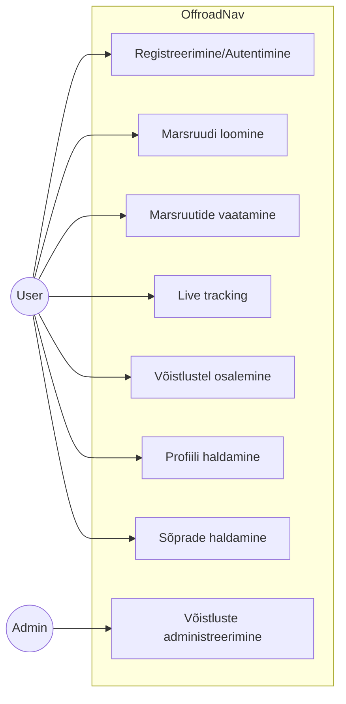
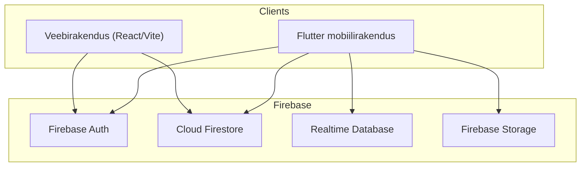
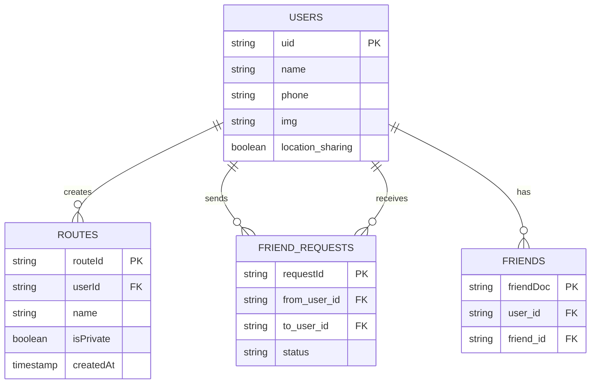
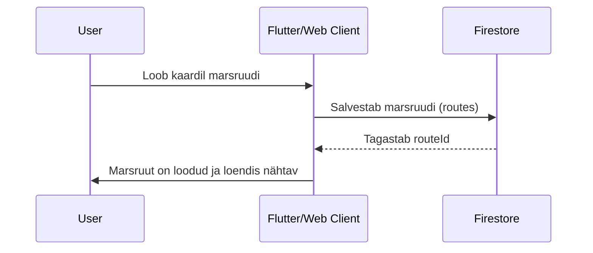

# Offroad Nav — Projekti dokumentatsioon

## 1. Süsteemi üldkirjeldus

### 1.1 Projekti eesmärk
Offroad Nav on maastikusõidu navigeerimis- ja võistlussüsteem. Projekt võimaldab kasutajatel planeerida marsruute, läbida neid reaalajas jälgimisega ning osaleda võistlustel.

### 1.2 Lahendatav probleem
* Puudub ühtne keskkond maastikumarsruutide loomiseks ja ohutuks läbimiseks, arvestades keelatud alasid.
* Osalejate jooksva asukoha kontroll ja võistluse kulgemise sünkroonimine on keeruline.
* Puudub ühtne kasutajaprofiil ja marsruudiajalugu eri klientides.

### 1.3 Sihtgrupid ja rollid
| Roll | Kirjeldus | Põhiõigused |
| --- | --- | --- |
| **User** | Tavakasutaja | Registreerimine/autentimine, marsruutide loomine ja läbimine, võistlustel osalemine, profiili haldamine, sõbrad ja vestlused. |
| **Admin** | Võistluste korraldaja / administraator ja sisu moderaator | Võistluste ja reeglite haldamine, ligipääs administratiivsetele tegevustele (võistluse loomine, osalejate kontroll, marsruutide ja tsoonide modereerimine). |

> Märkus: rolle määratakse andmemudeli ja UI tasemel, kuid ligipääsud tuleb täpsustada ka Firebase Security Rules reeglites Firestore’i ja RTDB jaoks.

### 1.4 Peamised kasutusstsenaariumid
1. **Registreerimine ja sisselogimine** mobiilirakendusse või veebikliendisse.
2. **Marsruudi loomine** kaardil ja salvestamine Firestore’i.
3. **Marsruudi käivitamine** live-jälgimisega ning koordinaatide saatmine Realtime Database’i.
4. **Võistlusel osalemine** (režiimi valik, start, tulemuste fikseerimine).
5. **Marsruutide loendi vaatamine** ja haldamine (Public/Private, kustutamine).
6. **Kasutajaprofiili haldamine** ja asukohanähtavuse seadistamine.

---

## 2. Funktsionaalsed nõuded

Allpool on kirjeldatud süsteemi funktsioonid koos kolme kohustusliku aspektiga: *mida teeb*, *millal käivitatakse* ja *millistest andmetest sõltub*.

### 2.1 Registreerimine ja autentimine
**Mida teeb:**
* Registreerimine/sisselogimine läbi Firebase Authi (email/password, telefon, Google).

**Millal käivitatakse:**
* Rakenduse käivitamisel, kui kasutaja ei ole autentitud.

**Andmesõltuvused:**
* Firebase Auth.
* Firestore’i kollektsioon `users`, kus hoitakse kasutaja profiili ja lisavälju (name, description, phone, img, location_sharing, favourite_route).

### 2.2 Marsruudid: loomine, muutmine, lõpetamine
**Mida teeb:**
* Loob kaardil marsruudi, salvestab selle Firestore’i, toetab marsruudi nähtavuse haldamist (Public/Private) ja kustutamist.

**Millal käivitatakse:**
* Marsruudi loomisel veebikliendis või mobiilirakenduses.
* Olemasoleva marsruudi muutmisel või kustutamisel.

**Andmesõltuvused:**
* Firestore’i kollektsioon `routes` (sh väljad `userId`, `createdAt`, `isPrivate`).

### 2.3 Live tracking
**Mida teeb:**
* Jälgib kasutaja hetkeasukohta marsruudil, kuvab läbitud ja allesjäänud teekonda, arvutab ETA ning finišini jäänud vahemaad ning saadab koordinaadid Firebase RTDB-sse.

**Millal käivitatakse:**
* Kui kasutaja käivitab marsruudi ja liikumise ajal.

**Andmesõltuvused:**
* `Location API` ja `Geolocator`.
* Firebase Realtime Database: `users/{userId}/location` (lat, lng, timestamp).

### 2.4 Keelatud alad
**Mida teeb:**
* Kuvab kaitse- ja piirangutsoonide kihid (kaitseala, hoiuala, liikumispiirangud ja keelualad) ning keelab marsruudi koostamise läbi nende alade.

**Millal käivitatakse:**
* Kihtide sisselülitamisel ja marsruudi koostamisel.

**Andmesõltuvused:**
* GeoJSON-failid kataloogis `assets/geo/`.
* Kaardikihid, mida kuvatakse kasutajaliideses.

### 2.5 Võistlused
**Mida teeb:**
* Võimaldab luua võistlusi ja valida režiime (`fastest_time`, `most_waypoints`, `checkpoint_hunt`, `fuel_economy`).

**Millal käivitatakse:**
* Kui administraator loob võistluse, vaadatakse reegleid või kasutajad osalevad.

**Andmesõltuvused:**
* Režiimi konfiguratsioon (ID, pealkiri, kirjeldus).
* Osalejate ja marsruutide andmed (Firestore).

**Admin-haldus:**
* Võistluste loomine, reeglite valik, administraatorite määramine.
* Osalejate ja võistluse oleku haldamine.

### 2.6 Teavitused
**Mida teeb:**
* Teavitab kasutajat olulistest sündmustest (marsruudi start, võistluse staatuse muutus, sõbrakutsed).

**Millal käivitatakse:**
* Firestore’i/RTDB andmeseisundi muutumisel.

**Andmesõltuvused:**
* Firestore’i/RTDB sündmused ja UI sündmused.

### 2.7 Kasutajaprofiil
**Mida teeb:**
* Kuvab ja muudab profiili, sh avatari, kirjeldust ja asukohanähtavuse seadeid.

**Millal käivitatakse:**
* Profiili avamisel või muutmisel.

**Andmesõltuvused:**
* Firestore’i kollektsioon `users`.

---

## 3. Diagrammid ja arhitektuuri visualiseerimine

### 3.1 Use Case Diagram (Mermaid)


### 3.2 Rakenduse arhitektuuriskeem


### 3.3 Projekti kaustastruktuur (kõrgtase)
```text
Navigation_offroad/
├── lib/                # Flutter rakendus (Clean Architecture)
├── assets/             # kaardid, geojson, pildid
├── web_app/            # Web (React + Vite)
├── android/ ios/ web/  # Flutteri platvormikihid
├── functions/          # Firebase Functions (kui kasutusel)
└── firebase.json       # Firebase konfiguratsioon
```

### 3.4 ER-diagramm (Firestore + RTDB)


RTDB live-asukoha struktuur:
```
users/{userId}/location
  - lat
  - lng
  - timestamp
```

### 3.5 Interaktsioonivoog: marsruudi loomine ja sünkroonimine


---

## 4. Äriprotsesside loogika

### 4.1 Marsruudi loomine
1. Kasutaja valib kaardil punktid.
2. Rakendus valideerib trajektoori (ei tohi lõigata keelatud alasid).
3. Marsruut salvestatakse Firestore’i kollektsiooni `routes`.
4. Kasutaja määrab nähtavuse (Public/Private).

**Tingimused ja piirangud:**
* Marsruuti ei tohi koostada läbi keelatud alade.
* Kui `isPrivate = true`, näeb marsruuti ainult omanik.

### 4.2 Võistlusega liitumine
1. Kasutaja avab võistluste loendi.
2. Valib võistluse ja režiimi.
3. Kontrollitakse võistluse staatust (aktiivne/suletud).
4. Kasutaja lisatakse osalejate loendisse.

**Tingimused ja piirangud:**
* Pärast võistluse lõppu liituda ei saa.
* Mõne režiimi puhul on vajalik administraatori kinnitus.

### 4.3 Võitjate arvestus
1. Pärast võistluse lõppu kogub süsteem tulemused.
2. Algoritm võrdleb mõõdikuid (aeg, kontrollpunktide arv, ökonoomsus).
3. Moodustatakse edetabel.

### 4.4 Administraatori õiguste üleandmine
1. Praegune administraator valib uue administraatori.
2. Süsteem uuendab valitud osaleja rolli võistluse andmetes.
3. Uus administraator saab administraatoriõigused.

### 4.5 Käitumine keelatud alade korral
1. Marsruudi koostamisel kontrollitakse ristumist GeoJSON aladega.
2. Ristumise korral näidatakse kasutajale hoiatust.
3. Marsruuti ei salvestata enne, kui konflikt on eemaldatud.

---

## 5. Tehniline dokumentatsioon

### 5.1 Tehnoloogiavirn
* **Flutter** (mobiiliklient)
* **React + Vite** (veebiklient)
* **Firebase**: Auth, Firestore, Realtime Database, Storage

### 5.2 Peamised sõltuvused (Flutter)
| Pakett | Eesmärk |
| --- | --- |
| `firebase_core`, `firebase_auth` | Firebase’i baasintegreerimine ja autentimine |
| `cloud_firestore` | marsruutide ja profiiliandmete salvestus |
| `firebase_database` | live-jälgimine |
| `google_maps_flutter` | kaardifunktsioonid |
| `geolocator`, `location` | geolokatsioon |
| `flutter_riverpod` | olekuhaldus |

Täielik loend on failis `pubspec.yaml`.

### 5.3 Arenduskeskkonna seadistus
1. Paigalda Flutter SDK.
2. Paigalda Node.js ja npm (`web_app` jaoks).
3. Google Maps API võti ei ole salvestatud koodi sees. Võti tuleb lisada `.env` faili projekti juurkaustas ning see süstitakse Androidi build’i käigus automaatselt.
4. Loo projekti juurkausta `.env` fail ja lisa sinna vajalikud API võtmed, näiteks:
  
   ```GOOGLE_MAPS_API_KEY=your_google_maps_api_key_here```
   
Ilma `.env` failita Androidi rakenduse build ebaõnnestub, kuna API võti lisatakse build’i ajal.
7. Loo `web_app` jaoks `.env` ja lisa Firebase võtmed.

### 5.4 Projekti build (Dev + Prod)
**Dev (Flutter):**
```bash
flutter pub get
flutter run
```

**Prod (Flutter):**
```bash
flutter build apk
flutter build ios
```

**Web (React/Vite):**
```bash
cd web_app
npm install
npm run dev
npm run build
```

### 5.5 Kuidas Firebase integratsioon töötab
* Firebase ühendus konfigureeritakse failide `firebase_options.dart` ja `firebase.json` kaudu.
* Firestore hoiab marsruute, profiile, sõbrasuhteid ja võistluse andmeid.
* RTDB hoiab kasutajate live-asukoha andmeid (tracking).

### 5.6 Turvareeglid (Security Rules)
Näidis Firestore’i reeglitest:
```js
rules_version = '2';
service cloud.firestore {
  match /databases/{database}/documents {

    match /users/{userId} {
      allow read: if request.auth != null;
      allow write: if request.auth != null && request.auth.uid == userId;
    }

    match /friend_requests/{requestId} {
      allow create: if request.auth != null &&
        request.resource.data.from_user_id == request.auth.uid;

      allow update: if request.auth != null &&
        resource.data.to_user_id == request.auth.uid;

      allow read: if request.auth != null &&
        (resource.data.from_user_id == request.auth.uid ||
         resource.data.to_user_id == request.auth.uid);

      allow delete: if request.auth != null &&
        (resource.data.from_user_id == request.auth.uid ||
         resource.data.to_user_id == request.auth.uid);
    }

    match /friends/{friendDoc} {
      allow create: if request.auth != null &&
        (request.resource.data.user_id == request.auth.uid ||
         request.resource.data.friend_id == request.auth.uid);

      allow read, delete: if request.auth != null &&
        (resource.data.user_id == request.auth.uid ||
         resource.data.friend_id == request.auth.uid);
    }

    match /routes/{routeId} {
      allow create: if request.auth != null && request.auth.uid == request.resource.data.userId;

      allow read: if request.auth != null &&
        (request.auth.uid == resource.data.userId || resource.data.isPrivate == false);

      allow update, delete: if request.auth != null && request.auth.uid == resource.data.userId;
    }
  }
}
```
Näidis Realtime Database’i reeglitest:
```    {
  "rules": {
    ".read": false,
    ".write": false,
      
    "users": {
      "$uid": {
        ".read": "auth != null && auth.uid === $uid",
        ".write": "auth != null && auth.uid === $uid"
      }
    },  
  	
    "groups_members": {
      "$groupId": {
        // чтобы участники могли проверить членство (не обязательно, но удобно)
        ".read": "auth != null && data.child(auth.uid).val() === true",
        // менять состав группы лучше делать с сервера/через Firestore,
        // поэтому здесь по умолчанию закрываем
        ".write": false
      }
    },  
      
    "groups_live": {
      "$groupId": {
        ".read": "auth != null",
        "$uid": {
          ".write": "auth != null && auth.uid === $uid"
        }
      }
    },
      
    "competition_meta": {
      "$compId": {
        ".read": "auth != null",
        ".write": "auth != null && (
          !data.exists() || data.child('adminId').val() == auth.uid
        )"
      }
    },

    "competitions_participants": {
      "$compId": {
        ".read": "auth != null && data.child(auth.uid).val() === true",
        ".write": false
      }
    },

    "competition_live": {
      "$compId": {
        ".read": "auth != null && root.child('competition_meta/' + $compId + '/adminId').val() == auth.uid",
        "$uid": {
          ".write": "auth != null && auth.uid == $uid"
        }
      }
    }
      
  }
}
```
### 5.7 Soovitused CI/CD jaoks
* Kasuta GitHub Actionsit Flutteri buildiks (`flutter build apk`) ja staatiliste kontrollide käivitamiseks.
* Veebiklienti saab juurutada Firebase Hostingusse, backend-funktsioonid Firebase Functionsi kaudu.
* Hoia võtmed ja saladused ainult CI Secrets keskkonnas; ära commiti `.env` faile.

---

## 6. README
Lühike README asub projekti juurkaustas ning suunab täieliku dokumentatsiooni juurde.

---

## 7. Näidis päringud/vastused (API tasand)
Kliendirakenduses toimub API kasutus Firebase SDK kaudu.

Näide marsruutide lugemisest Firestore’ist:
```dart
FirebaseFirestore.instance
  .collection('routes')
  .where('userId', isEqualTo: uid)
  .orderBy('createdAt', descending: true)
  .get();
```

Näide koordinaatide kirjutamisest RTDB-sse:
```dart
FirebaseDatabase.instance
  .ref('users/$uid/location')
  .set({'lat': lat, 'lng': lng, 'timestamp': DateTime.now().toIso8601String()});
```
